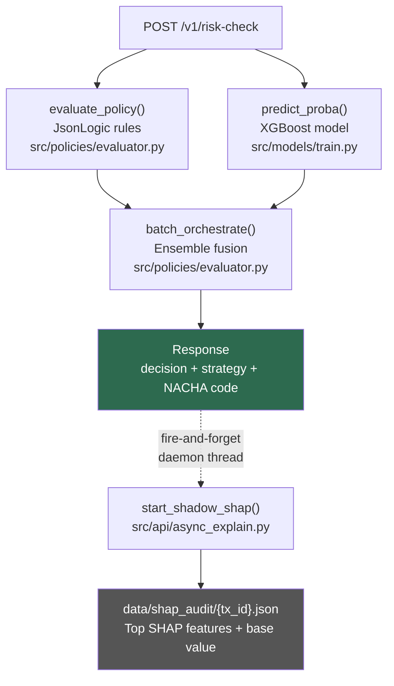

# Architecture Overview

SentryFlow uses a **two-speed design**: a synchronous fast path that returns a decision in under 30ms, and an asynchronous slow path for compute-heavy explainability that never blocks the response.

---

## System diagram



**Fast path** (synchronous, <30ms): steps A → B → C → D → E  
**Slow path** (background thread): E → F → G

---

## Components

### API Gateway (`src/api/`)

| File | Purpose |
|---|---|
| `main.py` | FastAPI app factory, mounts router |
| `router.py` | `POST /v1/risk-check` — orchestrates the three-stage fast path |
| `async_explain.py` | Fires a daemon thread after each response to compute SHAP values |

### Policy Engine (`src/policies/evaluator.py`)

Two functions:

- **`evaluate_policy(rules, data)`** — single-transaction rule evaluation. Runs each JsonLogic rule against the payload, collects triggered actions, and returns the highest-severity action with a Nacha Adverse Action Code.
- **`batch_orchestrate(rule_df, ml_scores)`** — vectorized ensemble fusion for backtest and API. Combines rule result with ML score into one of three named strategies.

### ML Models (`src/models/train.py`)

- **XGBoost** — supervised fraud classifier, trained on labeled transaction data
- **Isolation Forest** — unsupervised anomaly detector for synthetic identity clusters and zero-day patterns

Both models are persisted to `data/models/` via joblib and loaded at API startup.

### Governance (`src/governance/approval_queue.py`)

File-based policy approval queue. Risk Managers submit candidate rules; Senior Admins approve or reject via the dashboard Approval Inbox. Approved policies can be promoted to `data/active_policy.json`.

### Training Pipeline (`pipelines/backtest_flow.py`)

Metaflow DAG with five steps: data ingestion → temporal train/test split + model training → shadow backtest on held-out set → governance gate (FPR < 2%) → audit log. All metrics are computed on the held-out test set — not the training data.

### Risk Dashboard (`research/monitoring_dashboard.py`)

Streamlit app on port 8501. Features shadow backtesting, policy authoring, live-computed KPIs, governance inbox, and emergency override with audit logging.

---

## Data flow for a single transaction

```
Payload arrives at POST /v1/risk-check
│
├─ evaluate_policy() reads data/active_policy.json
│  └─ JsonLogic rules evaluated against payload fields
│  └─ Highest-severity action selected (DECLINE > VIDEO_ID > MFA > APPROVE)
│
├─ predict_proba() calls the loaded XGBoost model
│  └─ Returns fraud probability in [0.0, 1.0]
│
├─ batch_orchestrate() fuses both results
│  └─ ML score > 0.92 AND rule=PASS → ML_OVERRIDE_CRITICAL (REQUIRE_VIDEO_ID)
│  └─ ML score 0.75–0.92 AND rule=PASS → ML_ENHANCED_FRICTION (REQUIRE_MFA)
│  └─ All other cases → RULE_LED (rule decision wins)
│
└─ Response returned with decision + strategy + NACHA code + audit_id
   │
   └─ (background) SHAP values computed → written to data/shap_audit/{tx_id}.json
```

---

## Key design constraints

- **<30ms p99 latency** — nothing on the fast path may block on I/O or computation. SHAP always runs in a background thread.
- **Graceful degradation** — if the XGBoost model file is missing, a `MockModel` is used and `RULE_LED` still functions correctly.
- **Nacha 2026 compliance** — every decision includes a SHA256 policy signature and Adverse Action Code. See [Compliance](../compliance/nacha.md).
- **No-code policy authoring** — rules are JsonLogic JSON in `data/active_policy.json`. Risk Managers can change them without restarting the API.
